# Linear regression in Python

implementing **linear regression in Python**. There are several ways in which you can do that, you can do linear regression using *numpy*, *scipy*, *stats model* and *sckit learn*.

**Scikit-learn*: is a powerful Python module for machine learning. It contains *function for regression*, *classification*, *clustering*, *model selection* and *dimensionality reduction*.

**Boston Housing data set**, the data set contains *information* about the housing values in suburbs of Boston. This dataset was originally taken from the *StatLib library* is now available on the UCI Machine Learning Repository. UCI machine learning repository contains many interesting data sets.

## Exploring Boston Housing Data Set:

The first step is to import the required Python libraries into Ipython Notebook.

```
  %matplotlib inline

  import numpy as np
  import pandas as pd
  import scipy.stats as stats
  import matplotlib.pyplot as plt
  import sklearm 
```
This data set is available in sklearn Python module, so I will access it using scikitlearn. I am going to import Boston data set into Ipython notebook and store it in a variable called boston.

```
  from skelearn.datasets import load_boston
  boston = load_boston()
```
The object boston is a dictionary, so you can explore the keys of this dictionary.

```
  boston.keys()
  ['data', 'feature_names', 'DESCR'. 'target']

               boston.data.shape
               (506, 13)
```
to print the feature names of boston data set.

```
  print boston.feature_names
  ['CRIM' 'ZN' 'INDUS' 'CHAS' 'NOX' 'RM' 'AGE' 'DIS' 'RAD' 'TAX' 'PTRATIO' 'B' 'LSTAT']
```

In this data set I have 506 instances(rows) and 13 attributes or parameters(columns).The goal of this exercise is to predict the housing prices in boston region using the features given.

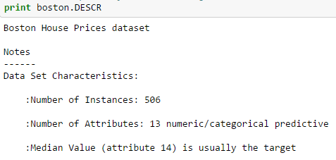
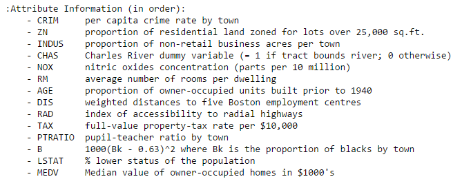

*convert boston.data into a pandas data frame.*

```
  bos = pd.DataFrame(boston.data)
  bos.head()
```
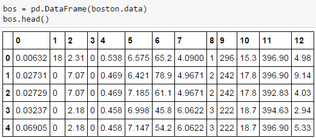

the column names are just numbers, so I am going to replace those numbers with the feature names.

```
  bos.columns = boston.feature_names
  bos.head()
```
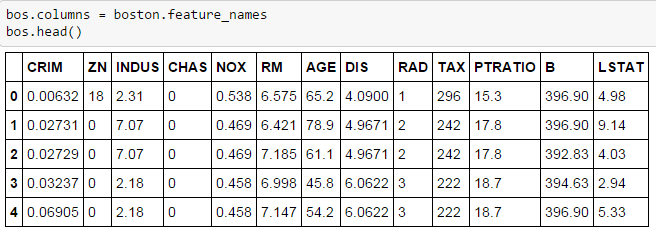

boston.target contains the housing prices.
```
  boston.targat[:5]
  array([24, 21.6, 34.7, 33.4, 36.2])
```

going to add these target prices to the bos data frame.

```
  bos['price'] = boston.target
```
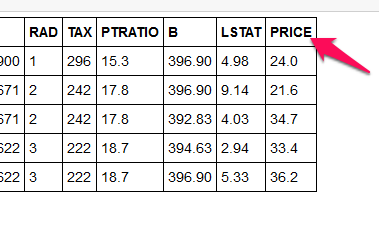

### Scikit Learn
going to fit a linear regression model and predict the Boston housing prices. I will use the least squares method as the way to estimate the coefficients.

```
  Y = boston housing price(also called “target” data in Python)
```
and

```
  X = all the other features (or independent variables)
```

First,going to import linear regression from sci-kit learn module. Then I am going to drop the price column as I want only the parameters as my X values. I am going to store linear regression object in a variable called lm.

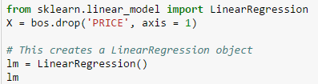

If you want to look inside the linear regression object, you can do so by typing LinearRegression. and the press ```<tab>``` key. This will give a list of functions available inside linear regression object.

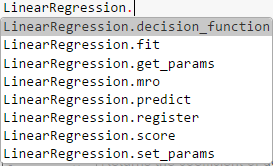

*Important functions to keep in mind while fitting a linear regression model are:*

```lm.predict()``` -> Predict Y using the linear model with estimated coefficients.

```lm.score()``` -> Returns the coefficient of determination ```(R^2)```. A measure of how well observed outcomes are replicated by the model, as the proportion of total variation of outcomes explained by the model.

You can also explore the functions inside lm object by pressing lm.```<tab>```

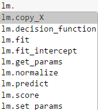

```.coef_``` gives the coefficients and .intercept_ gives the estimated intercepts.

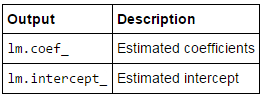

**Fitting a Linear Model**:going to use all 13 parameters to fit a linear regression model. Two other parameters that you can pass to linear regression object are ```fit_intercept and normalize```.

```In [20]: lm.fit(X, bos.PRICE)```

```Out[20]: LinearRegression(copy_X=True, fit_intercept=True, normalize=False)```

going to print the intercept and number of coefficients.

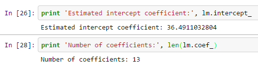

I then construct a data frame that contains features and estimated coefficients.

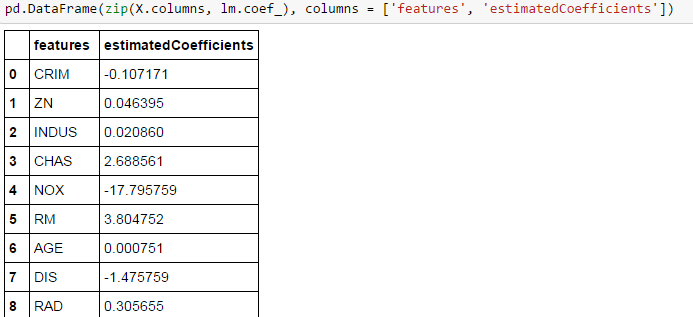

from the data frame that there is a high correlation between RM and prices. Lets plot a scatter plot between True housing prices and True RM.

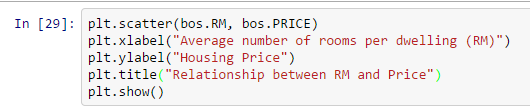

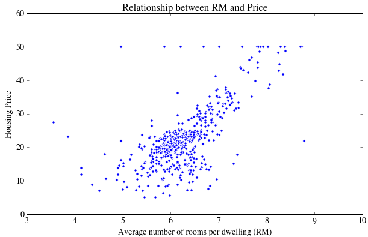

As you can see that there is a positive correlation between RM and housing prices.

*Predicting Prices*:going to calculate the predicted prices (Y^i) using lm.predict. Then I display the first 5 housing prices. These are my predicted housing prices.

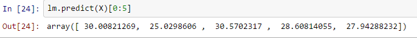

Then I plot a scatter plot to compare true prices and the predicted prices.

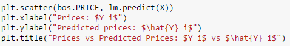

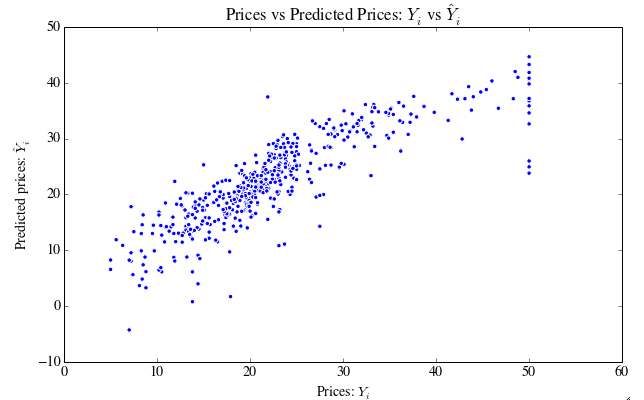

You can notice that there is some error in the prediction as the housing prices increase.

Lets calculate the ```mean squared error```.

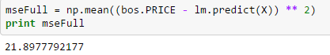

But if you fit linear regression for one feature the error will be very high. Lets take the feature ‘PTRATIO’ and calculate the mean squared error.


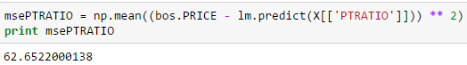

The mean squared error has increased. So this shows that a single feature is not a good predictor of housing prices.

*Training and validation data sets*: In practice you wont implement linear regression on the entire data set, you will have to split the data sets into training and test data sets. So that you train your model on training data and see how well it performed on test data.

How not to do train-test split:

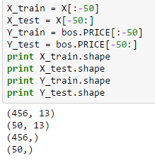

You can create training and test data sets manually, but this is not the right way to do, because you may be training your model on less expensive houses and testing on expensive houses.

*How to do train-test split:*You have to divide your data sets randomly. Scikit learn provides a function called train_test_split to do this.

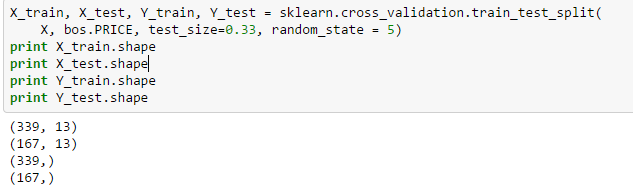

to build a linear regression model using my train-test data sets.

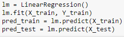

Then I calculate the mean squared error for training and test data.

*Input:*
```print “Fit a model X_train, and calculate MSE with Y_train:”, np.mean((Y_train – lm.predict(X_train)) ** 2)```

```print “Fit a model X_train, and calculate MSE with X_test, Y_test:”, np.mean((Y_test – lm.predict(X_test)) ** 2)```

*Output:*
```
  Fit a model X_train, and calculate MSE with Y_train: 19.5467584735 Fit a model X_train, and calculate MSE with X_test, Y_test: 28.5413672756
```

*Residual Plots:* Residual plots are a good way to visualize the errors in your data. If you have done a good job then your data should be randomly scattered around line zero. If you see structure in your data, that means your model is not capturing some thing. Maye be there is a interaction between 2 variables that you are not considering, or may be you are measuring time dependent data. If you get some structure in your data, you should go back to your model and check whether you are doing a good job with your parameters.

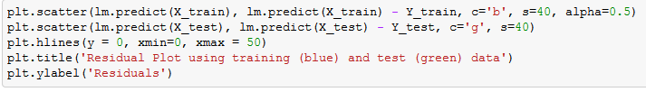

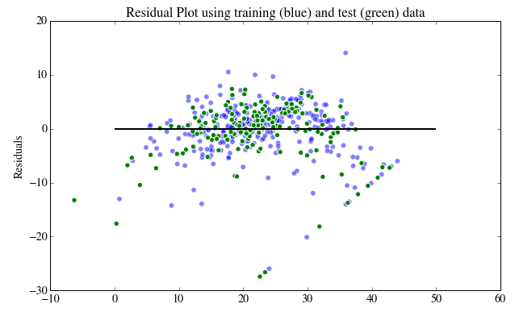

*summary*
1. explored the boston data set and then renamed its column names.

2. explored the boston data set using .DESCR, my goal was to predict the housing prices using the given features.

3. used Scikit learn to fit linear regression to the entire data set and calculated the mean squared error.

4. made a train-test split and calculated the mean squared error for my training data and test data.

5. then plotted the residuals for my training and test datasets.
