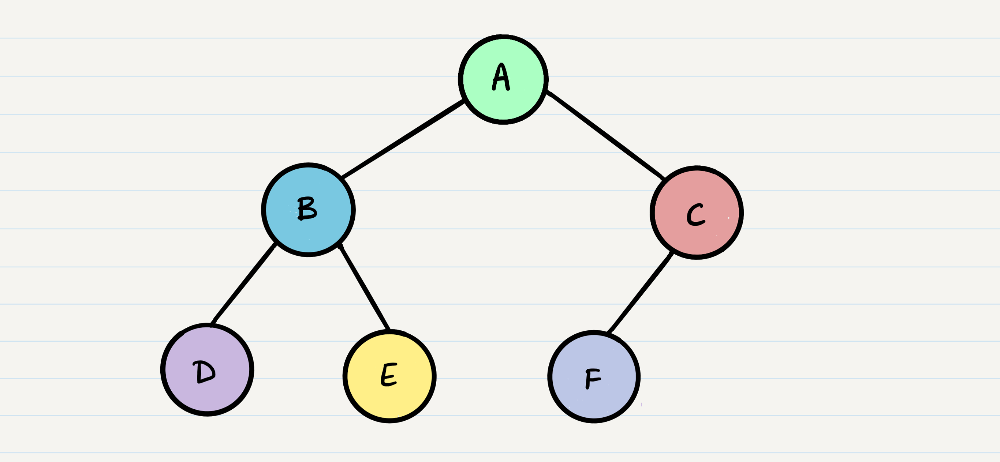
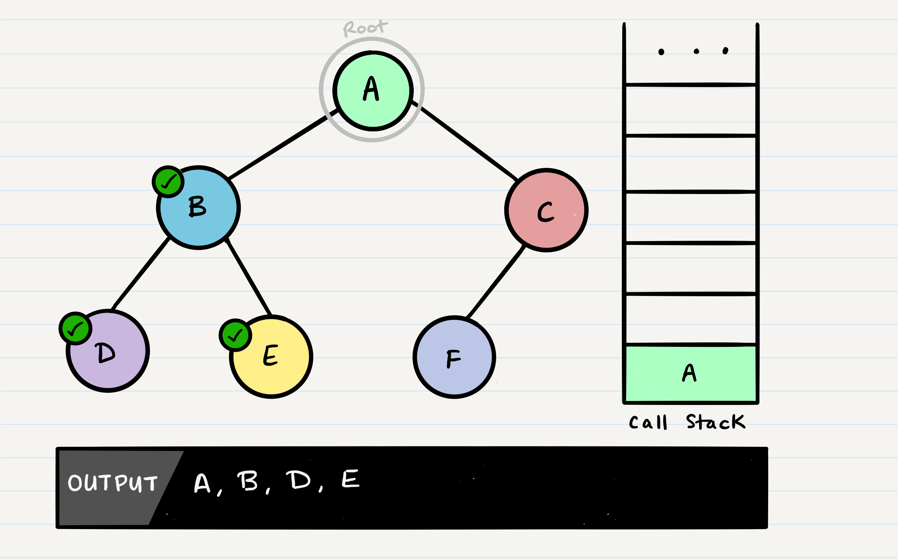

# Trees

**Tree**: the tree data structure is upside down: the root of the tree is on top. A tree consists of *nodes* and its connections are called *edges*.The bottom nodes are also named *leaf nodes*. A tree may not have a *cycle*. A tree with *eight nodes*. The root of the tree (5) is on top. Python does not have *built-in support for trees*.

**Common Terminology**: 

*Node* - A node is the individual item/data that makes up the data structure
*Root* - The root is the first/top Node in the tree
*Left Child* - The node that is positioned to the left of a root or node
*Right Child* - The node that is positioned to the right of a root or node
*Edge* - The edge in a tree is the link between a parent and child node
*Leaf* - A leaf is a node that does not contain any children
*Height* - The height of a tree is determined by the number of edges from the root to the bottommost node

**Sample Tree**


**Traversals**: An important aspect of trees is how to traverse them. Traversing a tree allows us to search for a node, print out the contents of a tree, and much more! There are two categories of traversals when it comes to trees:

1. **Depth First**

2. **Breadth First**


1. **Depth First**:Depth first traversal is where we prioritize going through the depth (height) of the tree first. There are multiple ways to carry out depth first traversal, and each method changes the order in which we search/print the root. Here are three methods for depth first traversal:

- Pre-order: ```root >> left >> right```
- In-order: ```left >> root >> right```
- Post-order: ```left >> right >> root```



Given the sample tree above, our traversals would result in different paths:

- Pre-order: ```A, B, D, E, C, F```
- In-order: ```D, B, E, A, F, C```
- Post-order: ```D, E, B, F, C, A```

The most common way to traverse through a tree is to use *recursion*. With these traversals, we rely on the call stack to navigate back up the tree when we have reached the end of a sub-path.

*Pre-order*:break down the pre-order traversal. Here is the pseudocode for this traversal method:
```
  ALGORITHM preOrder(root)

    OUTPUT <-- root.value

    if root.left is not NULL
        preOrder(root.left)

    if root.right is not NULL
        preOrder(root.right)
```
Pre-order means that the ```root``` has to be looked at first. In our case, looking at the root just means that we output its value. When we call ```preOrder``` for the first time, the ```root``` will be added to the call stack:


This means that we will output the ```root.value``` out to the console. Then, our next block of code instructs us to check if our ```root``` has a ```left``` node set. If the root does, we will then send the ```left``` node to our ```preOrder``` method recursively. This means that we make another function call, where ```B``` is our new ```root```:


This process continues until we reach a leaf node. Here’s the state of our tree when we hit our first leaf, ```D```:


*It’s important to note a few things that are about to happen:*

- The program will look for both a ```root.left``` and a ```root.right```. Both will return ```null```, so it will end the execution of that method call

- ```D``` will pop off of the call stack and the ```root``` will be reassigned back to ```B```

    - This is the heart of recursion: when we complete a function call, we pop it off the stack and are able to continue execution through the previous function call


The code block will now pick up where it left off when ```B``` was the root. Since it already looked for ```root.left```, it will now look for ```root.right```.


```E``` will output to the console. Since ```E``` is a leaf, it will complete the method code block, and pop ```E``` off of the call stack and make its way back up to ```B```.


In the function call, ```B``` has already checked for ```root.left```, and ```root.right```. There are no further lines of code to execute, so ```B``` will be popped off the call stack, so that we can resume execution of ```A```.



Following the same pattern as we did with the other nodes, ```A```’s call stack frame will pick up where it left off, and check out ```root.right```. ```C``` will be added to the call stack frame, and it will the new function’s ```root```.


```C``` will be outputted to the console, and ```root.left``` will be evaluated. Because ```C``` has a left child, ```preOrder``` will be called, with the parameter ```root.left```.


At this point, the program will find that ```F``` does not have any children and it will make its way back up the call stack up to ```C```.


```C``` does not have a ```root.right```, so it will pop off the call stack and return to ```A```.


*Traversal Pseudocode*: Here is the pseudocode for all three of the depth first traversals:

```Pre-order```
```
  ALGORITHM preOrder(root)
  // INPUT <-- root node
  // OUTPUT <-- pre-order output of tree node's values

      OUTPUT <-- root.value

      if root.left is not Null
          preOrder(root.left)

      if root.right is not NULL
          preOrder(root.right)
```

```in-order```

```
  ALGORITHM inOrder(root)
  // INPUT <-- root node
  // OUTPUT <-- in-order output of tree node's values

      if root.left is not NULL
          inOrder(root.left)

      OUTPUT <-- root.value

      if root.right is not NULL
          inOrder(root.right)
```

```pst-order```

```
  ALGORITHM postOrder(root)
  // INPUT <-- root node
  // OUTPUT <-- post-order output of tree node's values

      if root.left is not NULL
          postOrder(root.left)

      if root.right is not NULL
          postOrder(root.right)

      OUTPUT <-- root.value
```
**Notice** the similarities between the three different traversals above. The biggest difference between each of the traversals is *when you are looking at the root node.*

**Breadth First**:Breadth first traversal iterates through the tree by going through each level of the tree *node-by-node*. So, given our starting tree one more time:


Our output using breadth first traversal is now:

Output: ```A, B, C, D, E, F```

Traditionally, breadth first traversal uses a queue (instead of the call stack via recursion) to traverse the width/breadth of the tree. Let’s break down the process.

Given our starting tree shown above, let’s start by putting the ```root``` into the queue: