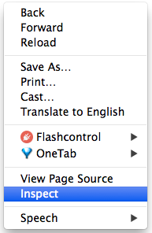
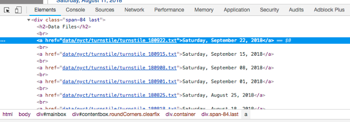
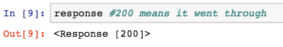
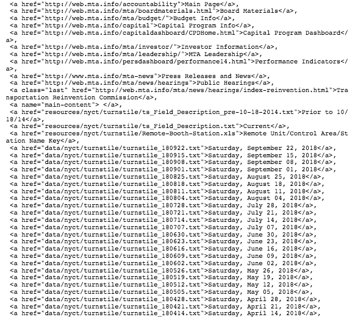

# How to Web Scrape with Python

**Web scraping**:- is a technique to automatically access and extract large amounts of information from a website, which can save a huge amount of time and effort. 

**New York MTA Data**
We will be downloading turnstile data from this site:
```http://web.mta.info/developers/turnstile.html```

**Important notes about web scraping:**
1. Read through the website’s Terms and Conditions to understand how you can legally use the data. Most sites prohibit you from using the data for commercial purposes.

2. Make sure you are not downloading data at too rapid a rate because this may break the website. You may potentially be blocked from the site as well.

**Inspecting the Website**: The first thing that we need to do is to figure out where we can locate the links to the files we want to download inside the multiple levels of HTML tags. Simply put, there is a lot of code on a website page and we want to find the relevant pieces of code that contains our data.

On the website, right click and click on “Inspect”. This allows you to see the raw code behind the site.



Once you’ve clicked on “Inspect”, you should see this console pop up.



Notice that on the top left of the console, there is an arrow symbol.

If you click on this arrow and then click on an area of the site itself, the code for that particular item will be highlighted in the console. I’ve clicked on the very first data file, Saturday, September 22, 2018 and the console has highlighted in blue the link to that particular file.

```
  <a href=”data/nyct/turnstile/turnstile_180922.txt”>Saturday, September 22, 2018</a>
```

Notice that all the .txt files are inside the <a> tag following the line above. As you do more web scraping, you will find that the <a> is used for hyperlinks.

Now that we’ve identified the location of the links, let’s get started on coding!

**Python Code**
We start by importing the following libraries.
```
  import requests
  import urllib.request
  import time
  from bs4 import BeautifulSoup
```
Next, we set the url to the website and access the site with our requests library.
```
  url = 'http://web.mta.info/developers/turnstile.html'
  response = requests.get(url)
```
If the access was successful, you should see the following output:



Next we parse the html with BeautifulSoup so that we can work with a nicer, nested BeautifulSoup data structure.

```
  soup = BeautifulSoup(response.text, “html.parser”)
```

We use the method .findAll to locate all of our <a> tags

```
  soup.findAll('a')
```
This code gives us every line of code that has an <a> tag. The information that we are interested in starts on line 38 as seen below. That is, the very first text file is located in line 38, so we want to grab the rest of the text files located below.



Next, let’s extract the actual link that we want. Let’s test out the first link.

```
  one_a_tag = soup.findAll(‘a’)[38]
  link = one_a_tag[‘href’]
```
This code saves the first text file, ‘data/nyct/turnstile/turnstile_180922.txt’ to our variable link. The full url to download the data is actually ‘http://web.mta.info/developers/data/nyct/turnstile/turnstile_180922.txt

’ which I discovered by clicking on the first data file on the website as a test. We can use our urllib.request library to download this file path to our computer. We provide request.urlretrieve with two parameters: file url and the filename. For my files, I named them “turnstile_180922.txt”, “turnstile_180901”, etc.

```
  download_url = 'http://web.mta.info/developers/'+ link
  urllib.request.urlretrieve(download_url,'./'+link[link.find('/turnstile_')+1:])
```
Last but not least, we should include this line of code so that we can pause our code for a second so that we are not spamming the website with requests. This helps us avoid getting flagged as a spammer.

```
  time.sleep(1)
```
Now that we understand how to download a file, let’s try downloading the entire set of data files with a for loop. The code below contains the entire set of code for web scraping the NY MTA turnstile data.

```

  # Import libraries
  import requests
  import urllib.request
  import time
  from bs4 import BeautifulSoup

  # Set the URL you want to webscrape from
  url = 'http://web.mta.info/developers/turnstile.html'

  # Connect to the URL
  response = requests.get(url)

  # Parse HTML and save to BeautifulSoup object¶
  soup = BeautifulSoup(response.text, "html.parser")

  # To download the whole data set, let's do a for loop through all a tags
  line_count = 1 #variable to track what line you are on
  for one_a_tag in soup.findAll('a'):  #'a' tags are for links
      if line_count >= 36: #code for text files starts at line 36
          link = one_a_tag['href']
          download_url = 'http://web.mta.info/developers/'+ link
          urllib.request.urlretrieve(download_url,'./'+link[link.find('/turnstile_')+1:]) 
          time.sleep(1) #pause the code for a sec
      #add 1 for next line
      line_count +=1
```